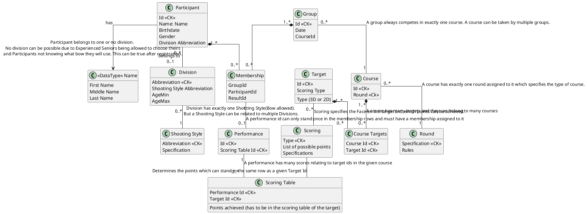

```plantuml
@startuml

hide empty members
skinparam linetype ortho


class "Participant" as participant {
    Id <<CK>>
    Name: Name
    Birthdate 
    Gender
    Division Abbreviation
}

class "<<DataType>> Name" as name {
    First Name
    Middle Name
    Last Name
}

class "Shooting Style" as shooting_style {
    Abbreviation <<CK>>
    Specification
}

class "Division" as division {
    Abbreviation <<CK>>
    Shooting Style Abbreviation
    AgeMin
    AgeMax
}

class "Membership" as membership {
    GroupId
    ParticipantId
    ResultId
}

class "Group" as group {
    Id <<CK>> 
    Date
    CourseId
}

class "Round" as round {
    Specification <<CK>>
    Rules
}

class "Course" as course {
    Id <<CK>>
    Round <<Ck>>
}

class "Course Targets" as course_targets {
    Course Id <<CK>>
    Target Id <<CK>>
}

class "Target" as target {
    Id <<CK>>
    Type (3D or 2D)
    Scoring Type 
}

class "Scoring" as scoring {
    Type <<CK>>
    List of possible points
    Specifications
}

class "Performance" as performance {
    Id <<CK>>
    Scoring Table Id <<CK>>
}

class "Scoring Table" as table {
    Performance Id <<CK>>
    Target Id <<CK>>
    Points achieved (has to be in the scoring table of the target)
}

participant "1..*" *-- "0..*" membership
group "1..*" *-- "0..*" membership

participant --> name : has
participant "0..* " -- "belongs to \n 0..1" division : "Participant belongs to one or no division.\n No division can be possible due to Experienced Seniors being allowed to choose theirs\n and Participants not knowing what bow they will use. This can be true after registration."
division "0..*" -- "1" shooting_style : "Division has exactly one Shooting Style(Bow allowed).\n But a Shooting Style can be related to multiple Divisions."

group "0..*" -- "1" course : A group always competes in exactly one course. A course can be taken by multiple groups.
course "0..*" -- "1" round : A course has exactly one round assigned to it which specifies the type of course.

course "1..*" *-- "0..*" course_targets : A course has many targets and they can belong to many courses
target "1..*" *-- "0..*" course_targets

membership "1" -- "0..1" performance : A performance id can only stand once in the membership rows and must have a membership assigned to it
performance "1" -- "0..*" table : A performance has many scores relating to target ids in the given course 
target "0..*" -- "1" scoring : Scoring specifies the Face on the target and which points can be achieved.

scoring -- table : Determines the points which can stand in the same row as a given Target Id

@enduml
```